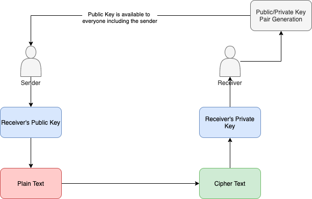
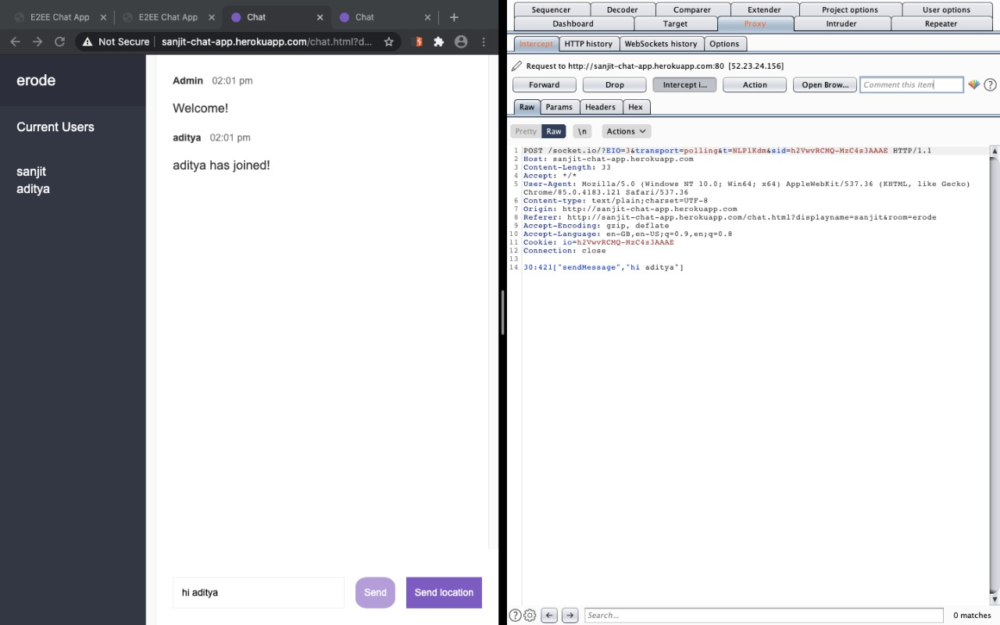
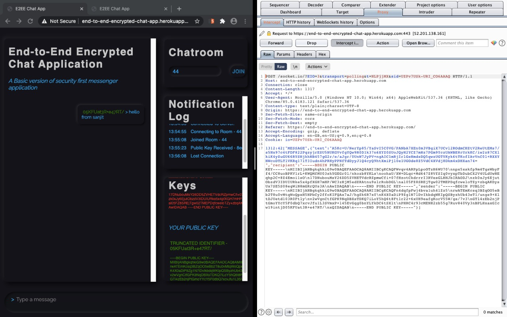

# End to End Chat Application

This is an end to end chat application that is a modified clone of Open-CryptoChat by Patrick Triest.

With Improved UI. Performed Penetration testing with Burp Suite.

Deployed as: https://end-to-end-encrypted-chat-app.herokuapp.com/

##### Tech Stack: ExpressJS, NodeJS, Socket.io, VueJS

## RSA Scheme

The working can be explained as follows

 Key generation: 
1. RSA works by the strength of choosing arbitrary prime numbers. So 2 unique prime numbers are chosen. Let them be p and q. 
2. Calculate a number ’n’ where n = pq. n will be used as the modulus for both the public and private keys. 
3. Find the totient of n, ϕ(n) ϕ(n)=(p-1)(q-1).
4.Choose a number e where 1 < e < ϕ(n), and such that e and ϕ(n) are co-prime numbers e will be a public key exponent. 
5. Determine d which satisfies the congruence relation de ≡ 1 (mod ϕ(n)).

 Encryption: 
1. Receiver transmits his/her public key (modulus n and exponent e) to sender but the private key will not be disclosed anywhere.
2. Sender will convert M to an integer where 0 < m < n by using a universal reversible protocol known to both parties as a padding scheme. 
3. Sender creates the cipher text by using the public key of the receiver corresponding to c ≡ me (mod n). 
4. This cipher text is sent to the receiver. 

Decryption: 
1. Person be uses his private key to recover the plain text with his private key m ≡ cd (mod n). 2. The padding schemes is reversed and applied to the cipher text c ≡ me (mod n), cd ≡(me)d (mod n), cd ≡ mde (mod n). 
3. Mod operation is symmetric so mde ≡ mde (mod n). Since de = 1 + kϕ(n), we can write mde ≡ m1 + kϕ(n) (mod n), mde ≡ m(mk)ϕ(n) (mod n), mde ≡ m (mod n). cd ≡ m (mod n) is the obtained plain text 

## Penetration Testing

Used [Burp Suite Community Edition](https://www.pentestgeek.com/what-is-burpsuite) (by PortSwigger).

#### **Vulnerable Chat Application**

A previous project to create a simple Chat application from [here](https://github.com/sanjitk7/chatAppDeploy) is highly vulnerable as seen in the below test. The plain text password can be intercepted and is vulnerable to manipulation.

#### **End-to-End Encryption**

The intercepted message is encrypted using RSA and therefore cannot be tampered with. Any tampering leads to failed decryption and therefore any kind of identity theft is not possible.

